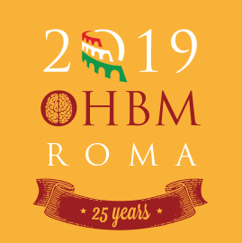

name: sidebar
layout: true

.perma-sidebar[
### Th587
## TemplateFlow

]

---

class: center middle

# TemplateFlow: a 4D standard space of neuroimaging standard spaces
### O. Esteban, R. Ciric, CJ. Markiewicz, RA. Poldrack, and KJ. Gorgolewski
#### Center for Reproducible Neuroscience
#### Stanford University

###### [oesteban.github.io/templateflow-ohbm19](https://oesteban.github.io/templateflow-ohbm19)

---

  

